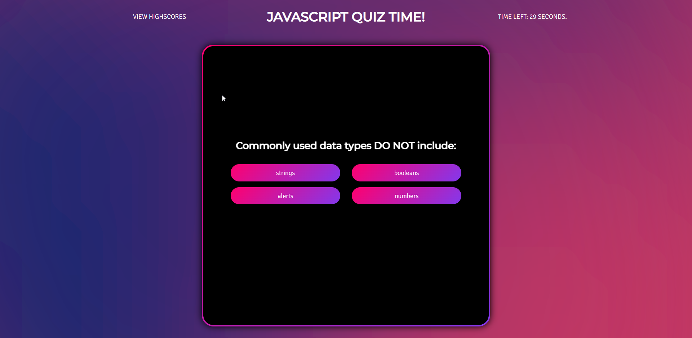
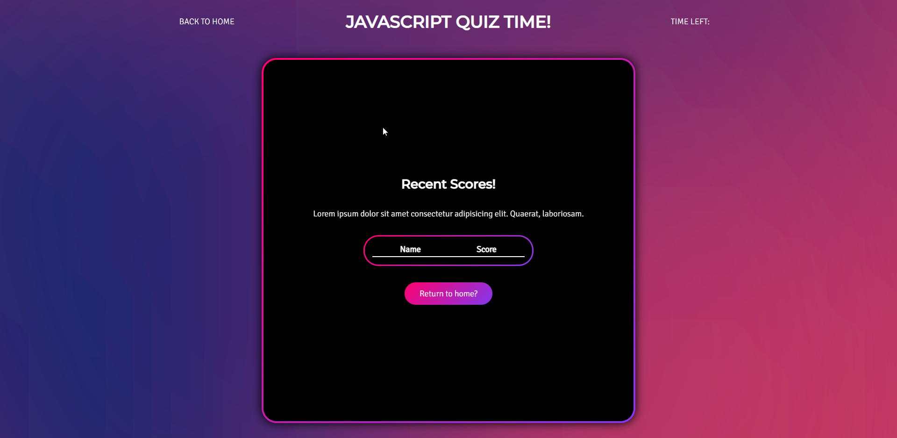

# JavaScript Quiz

The reason for making this quiz is I wanted to create a website to test my knowledge on JavaScript both practically and literally. 

I have used the various techniques from basic for loops to querySelctors and eventlisteners to create the quiz.

The quiz involves dynamically creating as well as showing and hiding elements with the HTML page to load new questions and answers, avoids cluttering the page with a section for each question

## Screenshots

## Usage

The GitHiub pages for this project can be found [Here](https://jackstockwell.github.io/quiz/index.html)

## Installation

N/A

## Testing

## Credits 

[Background Gradient from haikei](https://app.haikei.app/) - Used to create an SVG for the Background Image.

